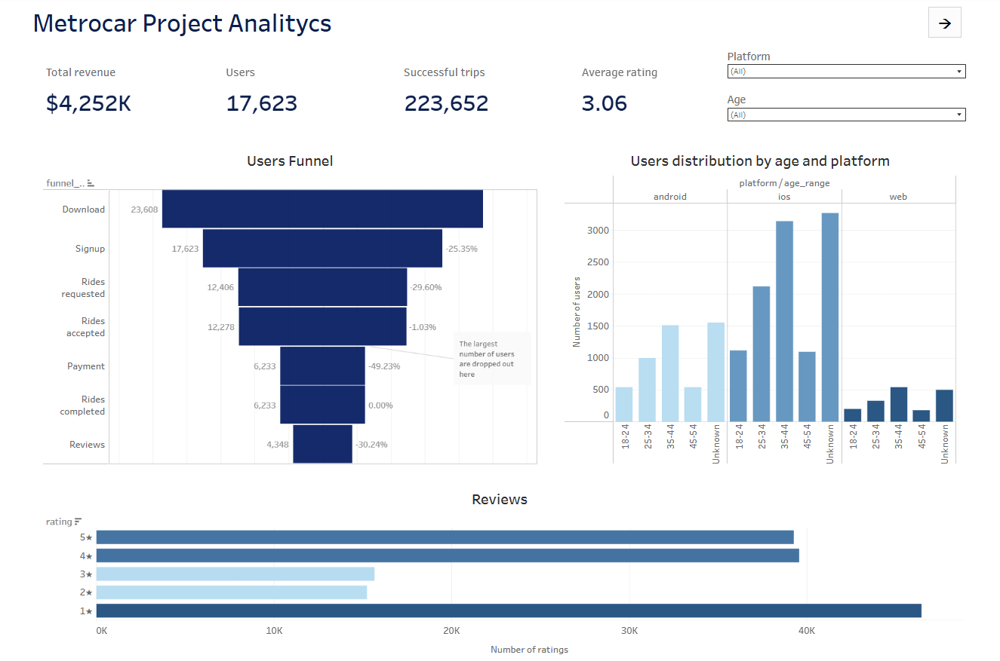
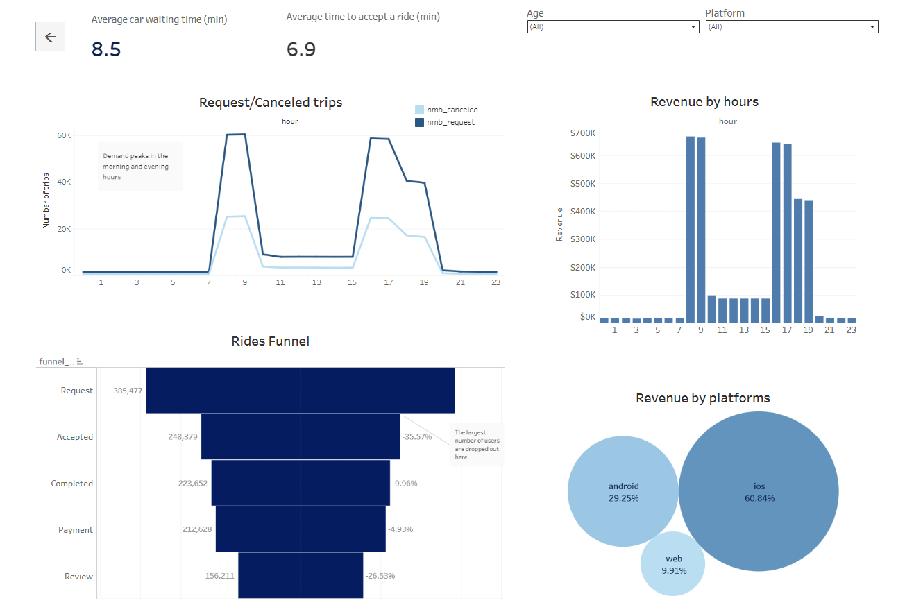

# 🚖 Metrocar - Ride Platform Analytics Project

## 📌 Project Overview

**Metrocar** - це сервіс для пошуку водіїв та пасажирів.

Даний проєкт присвячений аналізу даних додатку з метою отримання бізнес-інсайтів щодо поведінки користувачів, ефективності поїздок та доходу.

---

## 🎯 Objectives

Основні цілі аналізу:

- побудова воронки користувачів та поїздок;
- аналіз конверсії та завершених поїздок;
- дослідження доходу по часу та платформам;
- аналіз скасувань поїздок;
- сегментація користувачів;
- оцінка задоволеності клієнтів (рейтинги).

---

## 🧱 Dataset Structure

| Таблиця | Рядки | Колонки | Опис |
|----------|------|--------|----------|
| `ride_requests` | 385 477 | 10 | Деталі про поїздки: запит, прийняття, посадка, завершення та скасування |
| `transactions` | 223 652 | 5 | Інформація про платежі та статуси транзакцій |
| `signups` | 17 623 | 4 | Дані про реєстрацію та користувачів |
| `app_downloads` | 23 608 | 3 | Інформація про платформу та пристрій користувача |
| `reviews` | 156 211 | 6 | Рейтинги та відгуки користувачів |
| `funnel_analysis` |82 727 | 7 | Агреговані дані воронки користувачів |

---

## 📊 Dashboard

🔗 [**Натиснути, щоб переглянути дашборд**](https://public.tableau.com/app/profile/maryna.tolkachova/viz/ProjectMetrocar/Dashboard1)

У ході проєкту було розроблено інтерактивний дашборд у Tableau, який дозволяє досліджувати ключові показники платформи та відстежувати поведінку користувачів.

### Дашборд включає:

- Воронку користувачів
- Воронку поїздок
- Дохід за годинами доби
- Дохід по кожній платформі
- Розподіл користувачів за віковими групами та платформами
- Порівняння кількості запитів та скасованих поїздок
- Розподіл рейтингів користувачів

### Основні можливості

- Інтерактивна фільтрація даних
- Аналіз ключових KPI в одному місці
- Виявлення пікових періодів попиту
- Аналіз поведінки користувачів та ефективності платформи

### Попередній перегляд

---

## 🛠️ Tools

| Інструмент / Технологія | Призначення |
|------------------------|-------------|
| PostgreSQL             | Основна база даних для зберігання та SQL-аналізу |
| SQL                    | Витяг, трансформація та аналіз даних (CTE, JOIN, агрегації) |
| Tableau                | Візуалізація даних та створення інтерактивних дашбордів |
| GitHub                 | Контроль версій та розміщення портфоліо проєкту |

---

## 🧾 SQL Queries

Всі SQL-запити з аналізу знаходяться у файлі: [SQL_queries.sql](SQL_queries.sql)

У ньому представлені:
- аналіз доходу
- метрики воронки
- поведінка користувачів
- аналіз поїздок

---

## 🚀 Project Goal

Цей проєкт демонструє, як сирі дані платформи поїздок можна перетворити на **бізнес-інсайти**, які допомагають покращувати продукт, підвищувати дохід та оптимізувати користувацький досвід.

---

Автор проєкту: [Марина Толкачова](https://www.linkedin.com/in/maryna-tolkachova-8743b0196)
